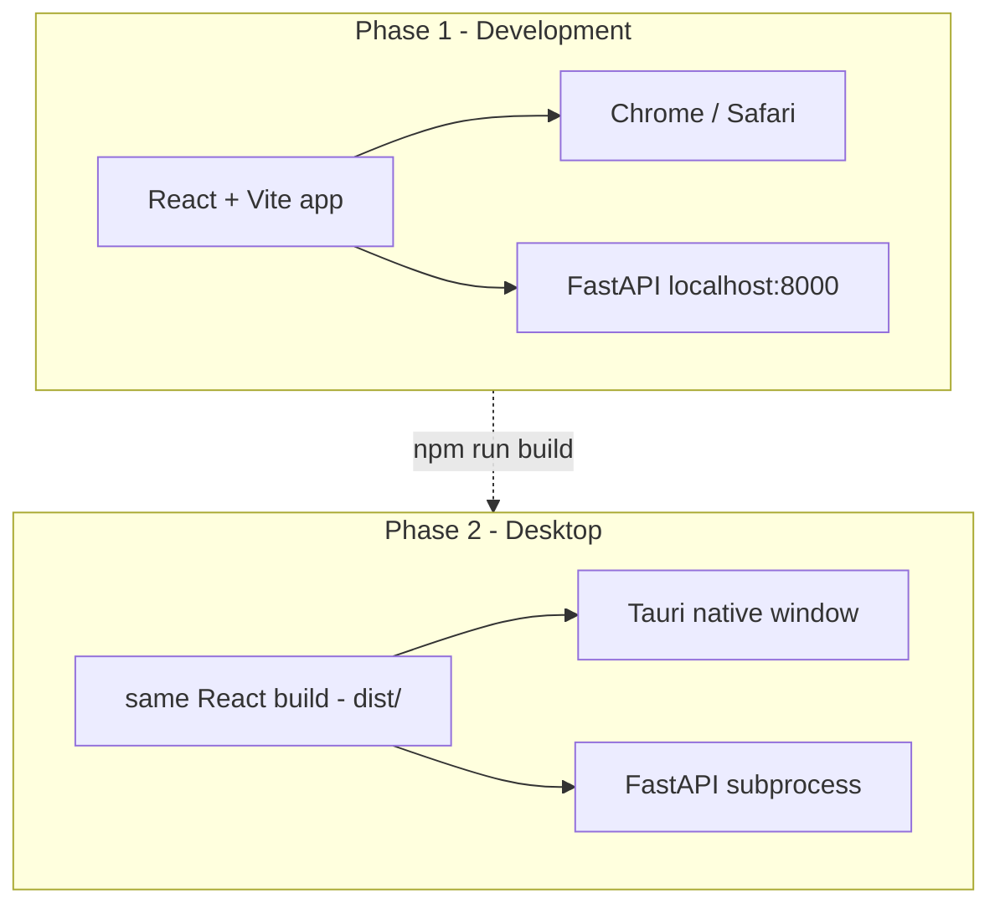

# Opal Gallery App — Frontend Plan (updated)

## Your questions answered

### Is web-first, then Mac/Windows, a good approach?

**Yes — this is the standard path and the right one for you.**

| Step | What you build | Why |
|------|----------------|-----|
| **1. Web app** | React UI + FastAPI in browser | Fast iteration, hot reload, easy debugging while OCR runs |
| **2. Tauri shell** | Same React build in native window | App icon, no browser tab, feels native |
| **3. Mobile later** | Same API, new client | Don't pay mobile complexity until desktop feels perfect |

You design and ship features once in React. Desktop is packaging, not a rewrite.

### Does Tauri accept React/JS? Will we reimplement?

**Tauri uses your existing web UI — no reimplementation.**

- **Tauri v2** = thin Rust shell + system WebView (WebView2 on Windows, WKWebView on Mac)
- **Frontend:** React, Vue, Svelte, or plain JS — **React + Vite is ideal**
- **Phase 2 work:** `npm run build` → point Tauri at `dist/` → add window + spawn Python API
- **~95% of UI code is identical** between browser and desktop; only desktop extras (tray icon, "Reveal in Finder", auto-start backend) are new

You will **not** rebuild the gallery in Swift, C#, or another framework.

---

## App naming (you suggested Opal)

**Opal** works well — short, distinct, not generic SaaS, evokes something personal and iridescent (mood/vibe shifts).

Other distinct options if you want alternatives:

| Name | Vibe |
|------|------|
| **Opal** | Personal gem collection; mood shifts with angle — fits vibe search |
| **Margins** | Literary — notes written in book margins |
| **Palimpsest** | Layers of text/history — very literary, slightly obscure |
| **Epigraph** | Opening quote before a chapter — precise for quote library |
| **Folio** | A collection of pages — clean, gallery feel |
| **Vestige** | Traces of moments — moody, minimal |

**Recommendation:** Proceed with **Opal** unless `/impeccable teach` surfaces something better. Finalize in Phase 0 `PRODUCT.md`.

---

## Design priority: Impeccable integration

You linked [Impeccable](https://github.com/pbakaus/impeccable) — use it **before writing UI code**, not after.

Impeccable is a **design skill for AI** (not a component library). It gives:
- 7 reference domains (typography, color, motion, spatial, interaction, responsive, UX writing)
- 23 commands (`/impeccable teach`, `craft`, `polish`, `audit`, `critique`, etc.)
- 27 anti-pattern rules (no Inter-everywhere, no purple gradients, no card-in-card slop)

### Phase 0 — Design foundation (before Phase 1a)

1. **Install Impeccable for Cursor** — copy `.cursor/skills/impeccable` from [impeccable.style](https://impeccable.style) into [photo-organizer](c:\Users\praja\photo-organizer)
2. **Run `/impeccable teach`** — generates project-root:
   - `PRODUCT.md` — users, purpose, personality (Opal = personal quote/literary gallery)
   - `DESIGN.md` — fonts, colors (OKLCH tinted neutrals), spacing, motion rules
3. **Run `/impeccable shape`** — wireframe feed, lightbox, search flows before React components
4. **During build:** `/impeccable polish`, `/impeccable audit` before Tauri packaging

This avoids generic "AI app" look and aligns with your **design + functionality priority**.

**Impeccable + Pinterest feed:** The feed layout comes from UX; Impeccable ensures typography, color, motion, and interaction feel **crafted** rather than template-generated.

---

## Your vision (summarized)

- **Product:** Opal — gallery for quote screenshots and literary/mood images
- **Platform:** Desktop first (Mac + Windows), mobile later
- **Usage:** Browse, vibe search, quote search — phased, not day 1
- **Look:** Social masonry feed, but **distinct** via Impeccable-guided design system
- **Constraint:** OCR/indexer runs independently; frontend work is safe in parallel

---

## Backend (unchanged recommendation)

**FastAPI** wrapping existing [`embedder.py`](embedder.py), [`chroma_store.py`](chroma_store.py), [`manifest.py`](manifest.py).

Local API on `localhost:8000`. Indexer uses [`index_library.py`](index_library.py) separately.

---

## Tech stack (confirmed)

| Layer | Choice | Notes |
|-------|--------|-------|
| **Design** | Impeccable skill + `PRODUCT.md` / `DESIGN.md` | Phase 0, before UI code |
| **API** | FastAPI | Reuses Python ML stack |
| **UI** | React + Vite + TypeScript | Same code for web + Tauri |
| **Styling** | Tailwind + tokens from `DESIGN.md` | Not generic defaults — Impeccable picks fonts/colors |
| **Grid** | Masonry (`react-masonry-css` or CSS columns) | Pinterest feed |
| **Desktop** | Tauri v2 | Wraps `frontend/dist` — no UI rewrite |
| **Transition** | Keep [`app.py`](app.py) | Fallback until Opal web UI reaches parity |

---

## Phased roadmap

### Phase 0 — Design system (Impeccable)

- Install Impeccable Cursor skill
- `/impeccable teach` → `PRODUCT.md`, `DESIGN.md` for Opal
- `/impeccable shape` → feed, lightbox, search UX
- Lock: app name, color tokens, font pairing, dark vs warm editorial (skill decides with your input)

### Phase 1 — Web gallery (browser on desktop)

**API:** `api/main.py` + routes for search, browse, images, stats, thumbs

**UI screens (from DESIGN.md):**
1. Masonry home feed — infinite scroll
2. Sticky search — vibe + quote
3. Lightbox — full image + OCR quote
4. Filters — has text, date, folder, similarity

**Not in v1:** Tauri, mobile, collections

### Phase 1e — Impeccable polish pass

- `/impeccable audit` — a11y, responsive, anti-patterns
- `/impeccable polish` — shipping readiness
- Optional: `npx impeccable detect frontend/` for deterministic lint

### Phase 2 — Tauri desktop (Mac + Windows)

- Wrap **same** React production build
- Launch FastAPI subprocess on app start
- Native: window chrome, dock/taskbar icon, "Reveal in Finder/Explorer"
- **No gallery UI rewrite**

### Phase 3 — Discovery features

Random/discover, copy quote, folder albums, export/share

### Phase 4 — Mobile (later)

Same API; React Native or Flutter client

---

## Suggested build order

1. **Impeccable teach + shape** (PRODUCT.md, DESIGN.md, wireframes)
2. FastAPI skeleton — browse + thumbs
3. React masonry feed from design tokens
4. Search + lightbox
5. Filters + similar images
6. Impeccable polish + audit
7. Tauri wrapper
8. Discover mode, albums, share

---

## What stays unchanged

- [`index_library.py`](index_library.py), [`find_duplicates.py`](find_duplicates.py)
- [`data/manifest.db`](data/manifest.db), [`my_quote_library/`](my_quote_library/)
- GPU: browse API avoids CLIP; search loads CLIP on demand

---

## Open decisions (minimal)

- **Final name:** Opal (default) vs alternatives above — settle in Phase 0
- **Offline-only:** assumed yes (local library)
- **OCR in progress:** browse works now; text enriches live as OCR completes

When you say **execute**, we start with **Phase 0: install Impeccable + teach/shape for Opal**, then Phase 1a API — safe while OCR runs.

---

## Execution status (2026-05-24)

**Blocked:** Cursor Plan mode prevents Python/TS file edits. Switch to **Agent mode** to continue implementation.

**Done in Plan mode:**
- [PRODUCT.md](c:\Users\praja\photo-organizer\PRODUCT.md) — Opal product definition, anti-slop rules
- [DESIGN.md](c:\Users\praja\photo-organizer\DESIGN.md) — tokens (Fraunces + IBM Plex, OKLCH palette, masonry layout)

**Ready to implement next (Agent mode):**
1. `manifest.py` — add `browse()`, `browse_count()`
2. `api/` — FastAPI (stats, browse, search, thumbs, similar)
3. `frontend/` — React + Vite + Tailwind, Opal UI from DESIGN.md
4. `requirements.txt` — add `fastapi`, `uvicorn`

**Quality bar for implementation:**
- No Inter, no purple gradients, no nested cards (Impeccable anti-patterns)
- Lazy CLIP load (browse = no GPU)
- Keyboard lightbox, reduced-motion support
- TypeScript strict, small focused components

